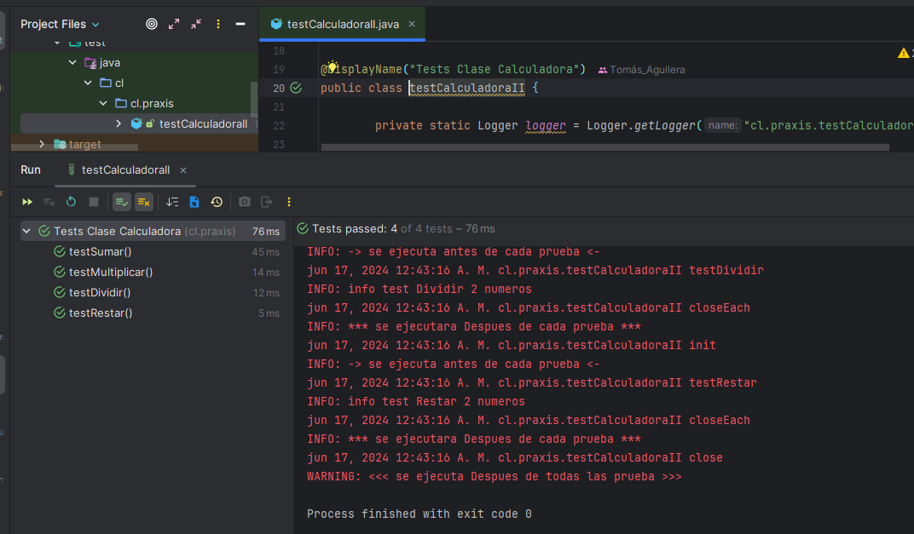

Desafío - Calculadora (Parte II)
--

En este desafío validaremos nuestros conocimientos vistos en las sesiones anteriores.
Lee todo el documento antes de comenzar el desarrollo individual o grupal, para asegurarte
de tener el máximo de puntaje y enfocar bien los esfuerzos.

Descripción
-

No contento con la ayuda que le brindó a sus amigos para repartir los montos de las pizzas,
usted decide tomar el código nuevamente y hacer mejoras en la programación. Teniendo esto
en consideración y sabiendo que las operaciones elementales son “sumar”, “restar”,
“multiplicar” y “dividir”. Usted decide realizar un diagrama de las fases de TDD y aplicarlos en
el ejercicio “Calculadora”. Para esto, debe considerar los siguientes requerimientos:

Requerimientos
-

1. Crear un nuevo proyecto con Maven.
   (1 Punto)
2. Agregar dependencias de JUnit 4.
   (2 Puntos)
3. Fase Roja: Crear clase de prueba CalculadoraTest, con métodos de prueba para
   sumar, restar, multiplicar y dividir.
   (2 Puntos)
4. Fase Verde: Implementa métodos en clase Calculadora (restar, sumar, multiplicar y
   dividir).
   (2 Puntos)
5. Fase de Refactorización: Escribir y mejorar lógica de métodos en clase Calculadora.
   (2 Puntos)
6. Ejecutar salida de Maven test.
   (1 Punto)

imagen de la salida de maven Test 

